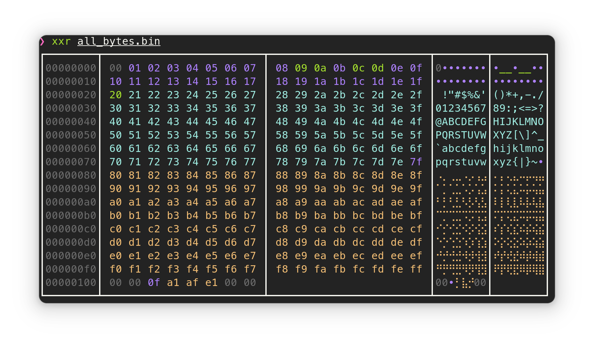

# xxr

Colorful hexdump.



## Install

```bash
cargo install xxr
```

## Usage

```
Usage: xxr [OPTIONS] <FILE>

Arguments:
  <FILE>  

Options:
  -x                use a classic xxd style
  -b, --braille     Use full braille for the ascii panel
  -B, --no-braille  No braille, use 'x' for non-ascii chars
  -h, --help        Print help
```